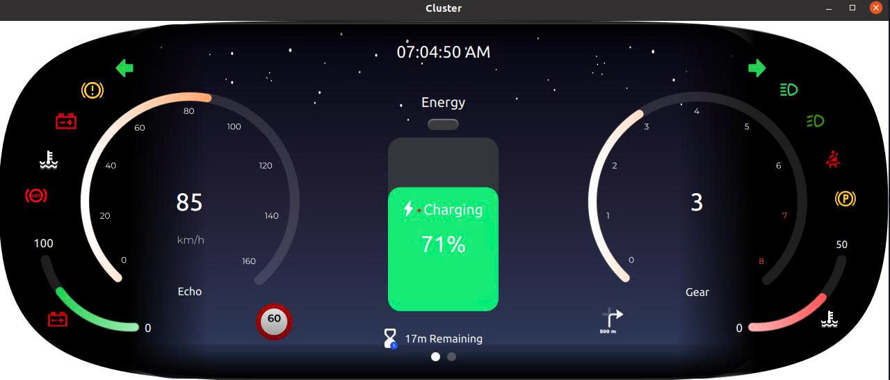
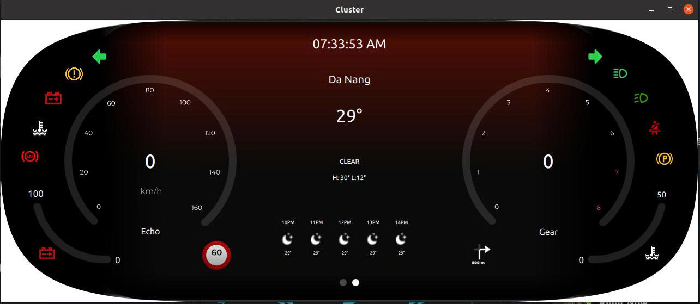
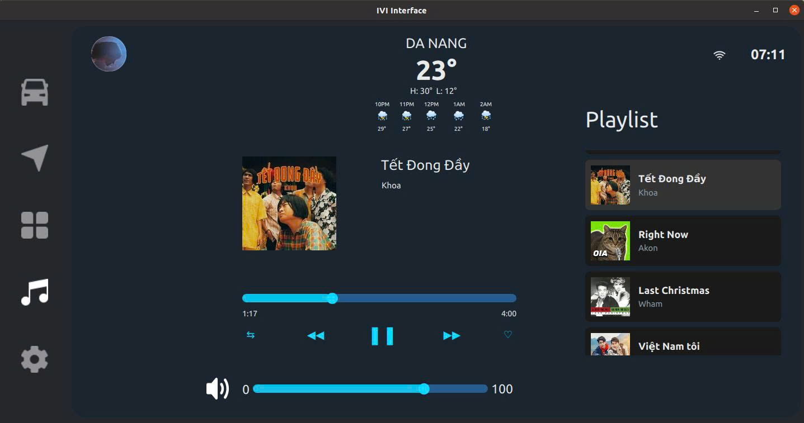
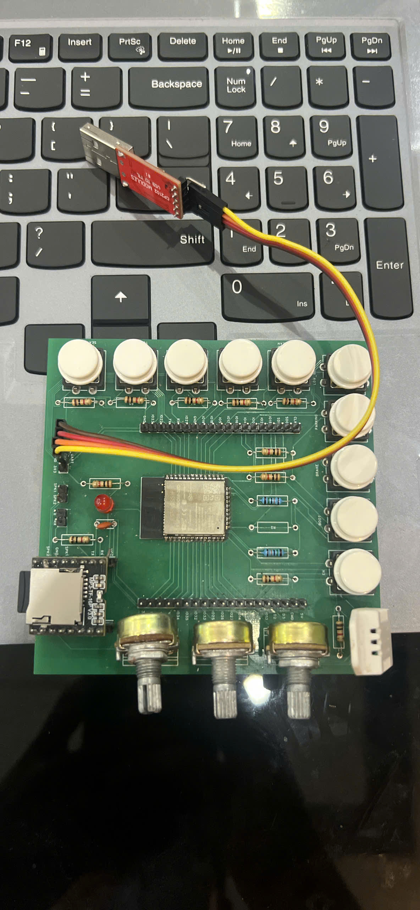

# Automotive HMI (Human-Machine Interface) System

A real-time Automotive Human-Machine Interface (HMI) dashboard application developed using the **Qt Framework** and **C++**. This project simulates a modern vehicle's digital instrument cluster, combining critical vehicle telemetry monitoring with infotainment features.

## 🚀 Features

- **Fuel Management Gauge:** Real-time monitoring and fluid visualization of fuel consumption and remaining levels.
- **Infotainment Music Player:** A fully functional media player simulation with interactive controls (Play, Pause, Next, Previous, Track Info).
- **Data Communication:** Integrated **UART** serial communication handler for low-latency data synchronization between backend microcontrollers (sensor simulation) and the HMI display.
- **Optimized UI/UX:** Built with **QML** for smooth dynamic animations and fluid UI rendering.

## 🛠️ Tech Stack & Tools

- **Programming Languages:** C++, QML
- **Framework:** Qt Framework (Qt Quick)
- **Protocols:** UART (Serial Communication)
- **Environment:** Linux / Ubuntu
- **Version Control:** Git

## 📸 Screenshots & Demo

## Cluster

  Cluster

  Cluster1

## IVI

  IVI

## Board

  Board

